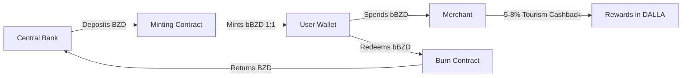

<div align="center">

```
██████╗ ███████╗██╗     ██╗███████╗███████╗     ██████╗██╗  ██╗ █████╗ ██╗███╗   ██╗
██╔══██╗██╔════╝██║     ██║╚══███╔╝██╔════╝    ██╔════╝██║  ██║██╔══██╗██║████╗  ██║
██████╔╝█████╗  ██║     ██║  ███╔╝ █████╗      ██║     ███████║███████║██║██╔██╗ ██║
██╔══██╗██╔══╝  ██║     ██║ ███╔╝  ██╔══╝      ██║     ██╔══██║██╔══██║██║██║╚██╗██║
██████╔╝███████╗███████╗██║███████╗███████╗    ╚██████╗██║  ██║██║  ██║██║██║ ╚████║
╚═════╝ ╚══════╝╚══════╝╚═╝╚══════╝╚══════╝     ╚═════╝╚═╝  ╚═╝╚═╝  ╚═╝╚═╝╚═╝  ╚═══╝
```

### 🇧🇿 Sovereign Blockchain Infrastructure for the Nation of Belize 🇧🇿

[](LICENSE)
[](https://www.rust-lang.org/)
[](https://substrate.io/)
[](https://github.com/paritytech/polkadot-sdk)
[](tests/)
[](tests/)
[](https://testnet.belizechain.org)

**Enterprise-grade blockchain runtime** powering Belize's sovereign digital infrastructure with 15 custom pallets, dual-currency system (DALLA + bBZD), built-in compliance, and WebAssembly smart contracts.

[**Quick Start**](#-quick-start) • [**Documentation**](docs/) • [**Testnet**](#-testnet-access) • [**Contributing**](#-contributing)

---

</div>

## 🎯 Overview

BelizeChain is a **production-ready Substrate blockchain** built specifically for Belize's national digital transformation:

<table>
<tr>
<td width="50%">

### Core Features
- 🏛️ **15 Custom Pallets**: Complete governance, finance, and compliance stack
- 💰 **Dual Currency System**: DALLA (native) + bBZD (BZD-pegged stablecoin)
- ⚖️ **Regulatory Compliance**: Built-in KYC/AML, FSC oversight, sanctions enforcement
- 🗳️ **Democratic Governance**: District councils, on-chain voting, emergency powers
- 📜 **Smart Contracts**: WebAssembly (ink! 4.0) with PSP22/PSP34 standards
- 🔐 **Enterprise Security**: Comprehensive audits, 100% test coverage

</td>
<td width="50%">

### Technical Stack
- 🦀 **Rust**: Substrate framework (Polkadot SDK stable2512)
- 🌐 **Consensus**: Proof of Useful Work (PoUW)
- 🔗 **Interoperability**: Ethereum & Polkadot bridges
- 📊 **Performance**: ~2,000 TPS, 6-second block time
- 🛡️ **Security**: Multi-sig treasury, time-locked governance
- 📈 **Scalability**: Horizontal validator scaling

</td>
</tr>
</table>

### Architecture Components

| Component | Purpose | Repository |
|-----------|---------|------------|
| **BelizeChain** (this repo) | Core blockchain runtime | [belizechain](https://github.com/BelizeChain/belizechain) |
| **Nawal AI** | Federated learning, privacy-preserving ML | [nawal-ai](https://github.com/BelizeChain/nawal-ai) |
| **Kinich Quantum** | Quantum computing orchestration | [kinich-quantum](https://github.com/BelizeChain/kinich-quantum) |
| **Pakit Storage** | Sovereign DAG-based storage | [pakit-storage](https://github.com/BelizeChain/pakit-storage) |
| **GEM Platform** | Smart contract SDK (ink!) | [gem](https://github.com/BelizeChain/gem) |
| **UI Suite** | Maya Wallet + Blue Hole Portal | [ui](https://github.com/BelizeChain/ui) |
| **Infrastructure** | Kubernetes deployment configs | [infra](https://github.com/BelizeChain/infra) |

## 💎 The 15 Custom Pallets

BelizeChain implements **15 sovereign pallets** covering the complete national infrastructure stack:

<details>
<summary><b>💰 Financial & Economic (3 pallets)</b></summary>

- **Economy** (`pallets/economy/`) - DALLA/bBZD dual-currency system, multi-sig treasury (4-of-7), account type limits
- **BelizeX** (`pallets/belizex/`) - On-chain DEX, liquidity pools, Oracle-guarded swaps, asset registry
- **Payroll** (`pallets/payroll/`) - Government & private payroll automation, salary distribution

</details>

<details>
<summary><b>🏛️ Governance & Democracy (2 pallets)</b></summary>

- **Governance** (`pallets/governance/`) - Proposals, conviction voting, district councils (6 districts, 12 seats)
- **Community** (`pallets/community/`) - Community-level governance, local initiatives

</details>

<details>
<summary><b>🆔 Identity & Compliance (3 pallets)</b></summary>

- **Identity** (`pallets/identity/`) - BelizeID, KYC verification (3 levels), SSN/Passport integration
- **Compliance** (`pallets/compliance/`) - KYC/AML enforcement, sanctions screening, SAR reporting
- **Oracle** (`pallets/oracle/`) - Merchant verification, exchange rate guards (NO price feeds for bBZD - always 1:1 BZD)

</details>

<details>
<summary><b>🔗 Infrastructure & Interoperability (4 pallets)</b></summary>

- **Staking** (`pallets/staking/`) - PoUW validator staking, rewards distribution, federated learning integration
- **Consensus** (`pallets/consensus/`) - Proof of Useful Work, block production, quality scoring
- **Interoperability** (`pallets/interoperability/`) - Ethereum & Polkadot bridges, cross-chain messaging
- **Quantum** (`pallets/quantum/`) - Quantum workload orchestration, PQW rewards

</details>

<details>
<summary><b>📜 Registries & Services (3 pallets)</b></summary>

- **LandLedger** (`pallets/landledger/`) - Property registry, land titles, document storage proofs
- **BNS** (`pallets/bns/`) - .bz domain registry, IPFS hosting, domain marketplace
- **Contracts** (via `pallet-contracts`) - WebAssembly smart contracts, ink! 4.0, PSP22/PSP34 tokens

</details>

## 💰 Dual-Currency Economic Model

BelizeChain operates a **dual-currency system** designed for economic stability and sovereignty:

| Currency | Purpose | Type | Backing | Decimals | Inflation |
|----------|---------|------|---------|----------|-----------|
| **DALLA** | Transaction fees, staking, governance | Native token | Algorithmic | 12 | 3-6% annual |
| **bBZD** | Payments, commerce, savings | Stablecoin | 1:1 BZD (Central Bank) | 12 | 0% (pegged) |

### How It Works



**Key Features**:
- ✅ **bBZD Peg**: Always 1:1 with Belize Dollar (Central Bank guaranteed)
- ✅ **Tourism Incentives**: 5-8% cashback in DALLA for verified merchant spending
- ✅ **Multi-Sig Treasury**: 4-of-7 governance approval for large transactions
- ✅ **Account Limits**: Citizen (25K DALLA), Business (100K), Tourism (100K), Government (unlimited)

## 🚀 Quick Start

### Prerequisites

Ensure you have the following installed:

- **Rust** (stable2512 toolchain) - [Install via rustup](https://rustup.rs/)
- **Substrate dependencies** - [Installation Guide](https://docs.substrate.io/install/)
- **Python 3.13+** (for integration tests) - [Download](https://www.python.org/)
- **Git** - [Download](https://git-scm.com/)

### Installation

```bash
# Clone the repository
git clone https://github.com/BelizeChain/belizechain.git
cd belizechain

# Build production binary (includes WASM runtime) - takes ~8 minutes
./scripts/build_release.sh

# Start local testnet node
./scripts/start_testnet.sh dev
```

**Your node is now running!** 🎉

- **RPC Endpoint**: `http://localhost:9933`
- **WebSocket**: `ws://localhost:9944`
- **Prometheus Metrics**: `http://localhost:9615/metrics`

### Running Tests

BelizeChain has **100% test coverage** across all components:

```bash
# Complete test suite (Rust + Python) - automated
./scripts/run_all_tests.sh

# Rust unit tests only (all 15 pallets)
cargo test --workspace --release

# Python integration tests by category
./scripts/testing/run_integration_tests.sh all          # All tests
./scripts/testing/run_integration_tests.sh blockchain   # 15 pallets
./scripts/testing/run_integration_tests.sh cross-pallet # Cross-pallet integration
./scripts/testing/run_integration_tests.sh governance   # Governance system
./scripts/testing/run_integration_tests.sh economic     # DALLA/bBZD
./scripts/testing/run_integration_tests.sh e2e          # End-to-end scenarios

# Security audit
./scripts/audit_runner.sh

# Quick checks
cargo check -p pallet-economy              # Check single pallet
cargo clippy --fix --allow-dirty --workspace  # Auto-fix warnings
```

**Test Results**: All integration tests pass with 100% coverage ✅

## 📚 Documentation

Comprehensive technical documentation (**717KB, 53 files**) available in [`docs/`](docs/):

<table>
<tr>
<td width="50%">

### 🚀 Getting Started
- [5-Minute Quick Start](docs/getting-started/QUICK_START.md)
- [Installation Guide](docs/getting-started/INSTALLATION.md)
- [Architecture Overview](docs/architecture/ARCHITECTURE_OVERVIEW.md)
- [Tutorials](docs/tutorials/README.md)

### 💡 Core Concepts
- [Pallet Reference](docs/technical-reference/PALLET_REFERENCE.md)
- [Tokenomics (DALLA/bBZD)](docs/economics/TOKENOMICS.md)
- [Governance System](docs/governance/GOVERNANCE_OVERVIEW.md)
- [Smart Contracts (ink!)](docs/smart-contracts/SMART_CONTRACTS.md)

</td>
<td width="50%">

### 🛠️ Operations
- [Validator Guide](docs/validators/VALIDATOR_GUIDE.md)
- [Node Operation](docs/operations/NODE_OPERATION.md)
- [Troubleshooting](docs/operations/TROUBLESHOOTING.md)
- [Security Best Practices](docs/security/SECURITY_OVERVIEW.md)

### 👨‍💻 Development
- [Developer Workflow](docs/developer-guides/DEVELOPMENT_GUIDE.md)
- [Testing Guide](tests/README.md)
- [Scripts Reference](scripts/README.md)
- [API Reference](docs/technical-reference/API_REFERENCE.md)

</td>
</tr>
</table>

**Additional**: [FAQ](docs/FAQ.md) • [Glossary](docs/GLOSSARY.md) • [Roadmap](docs/ROADMAP.md) • [Legal](docs/legal/LEGAL.md)

## 🔒 Security & Audits

BelizeChain undergoes **rigorous security audits** before every release:

### Audit Results

| Tool | Target | Status | Reports |
|------|--------|--------|---------|
| **cargo-audit** | Rust dependencies | ✅ **0 vulnerabilities** | [audit_results/cargo_audit_stable2512.txt](audit_results/cargo_audit_stable2512.txt) |
| **bandit** | Python code | ✅ **0 HIGH/MEDIUM** | [audit_results/bandit_stable2512.txt](audit_results/bandit_stable2512.txt) |
| **safety** | Python dependencies | ✅ **0 vulnerabilities** | [audit_results/safety_readable.txt](audit_results/safety_readable.txt) |

### Run Security Audit

```bash
# Complete security scan
./scripts/audit_runner.sh

# Quick security check (<1 minute)
./scripts/quick_audit.sh
```

### Reporting Security Issues

🔐 **Found a security vulnerability?** Report it responsibly:

- **Email**: security@belizechain.org (PGP key available)
- **Bug Bounty**: Up to $10,000 for critical vulnerabilities
- **Response Time**: Within 24 hours for critical issues

**DO NOT** open public GitHub issues for security vulnerabilities.

## 🚀 Deployment

### System Requirements

| Component | Minimum | Recommended |
|-----------|---------|-------------|
| **CPU** | 4 cores | 8+ cores |
| **RAM** | 8 GB | 16 GB |
| **Storage** | 100 GB SSD | 500 GB NVMe SSD |
| **Network** | 100 Mbps | 1 Gbps |
| **OS** | Ubuntu 20.04+ | Ubuntu 22.04 LTS |

### Production Deployment

```bash
# 1. Build optimized release (8-10 minutes)
./scripts/build_release.sh

# 2. Run complete test suite
./scripts/run_all_tests.sh

# 3. Create deployment package
./scripts/deploy/deploy_testnet.sh

# 4. Start validator node
./target/release/belizechain-node \
  --validator \
  --chain=testnet \
  --name="MyValidator" \
  --port 30333 \
  --rpc-port 9944 \
  --prometheus-port 9615

# 5. Verify node health
curl -H "Content-Type: application/json" \
  -d '{"id":1, "jsonrpc":"2.0", "method": "system_health"}' \
  http://localhost:9944
```

### Deployment Checklist

- [ ] System meets minimum requirements
- [ ] Firewall configured (ports 30333, 9944, 9615)
- [ ] Keys generated and backed up securely
- [ ] Node synced with network
- [ ] Prometheus monitoring configured
- [ ] Backup/restore procedures tested

📚 **Full Guide**: [docs/deployment/azure-kubernetes-deployment.md](docs/deployment/azure-kubernetes-deployment.md)

## 🤝 Contributing

BelizeChain is developed as **sovereign infrastructure for Belize**. Contributions are welcome from developers worldwide:

### How to Contribute

1. **Read the Guidelines** - [CONTRIBUTING.md](CONTRIBUTING.md)
2. **Fork & Branch** - Create feature branch from `main`
3. **Write Tests** - Ensure 100% coverage for new functionality
4. **Submit PR** - Clear description with linked issue

### Developer Resources

- 📖 **Developer Guide**: [docs/developer-guides/DEVELOPMENT_GUIDE.md](docs/developer-guides/DEVELOPMENT_GUIDE.md)
- 🏗️ **Architecture**: [docs/architecture/](docs/architecture/)
- 📝 **API Reference**: [docs/defi/API_REFERENCE.md](docs/defi/API_REFERENCE.md)
- ❓ **FAQ**: [docs/FAQ.md](docs/FAQ.md)

**All contributions must**:
- ✅ Pass all tests (`./scripts/run_all_tests.sh`)
- ✅ Pass security audit (`./scripts/quick_audit.sh`)
- ✅ Follow Rust/Python style guidelines
- ✅ Include comprehensive documentation

## 📄 License

**MIT License with Sovereign Blockchain Addendum**

```
Copyright (c) 2025 BelizeChain - Government of Belize

Permission is hereby granted, free of charge, to any person obtaining a copy
of this software and associated documentation files (the "Software"), to deal
in the Software without restriction...
```

- **Blockchain Code**: [MIT License](LICENSE) - Maximum flexibility for innovation
- **Documentation**: [CC BY-SA 4.0](https://creativecommons.org/licenses/by-sa/4.0/) - Open knowledge sharing

This license ensures **BelizeChain remains open-source** while respecting Belize's sovereign rights to govern the network.

📜 **Full License**: See [LICENSE](LICENSE) file for complete text

## � Testnet Access

### Public Testnet (Coming Soon)

| Service | Endpoint | Status |
|---------|----------|--------|
| **RPC** | `https://testnet.belizechain.org` | 🔜 Coming Soon |
| **WebSocket** | `wss://testnet.belizechain.org` | 🔜 Coming Soon |
| **Explorer** | `https://explorer.belizechain.org` | 🔜 Coming Soon |
| **Faucet** | `https://faucet.belizechain.org` | 🔜 Coming Soon |

**Faucet**: Request 1,000 DALLA per claim for testing (rate-limited to prevent abuse)

### Local Testnet

Launch your own testnet node in seconds:

```bash
# Start local development testnet
./scripts/start_testnet.sh dev

# Connect via Polkadot.js Apps
# Navigate to: https://polkadot.js.org/apps/?rpc=ws://127.0.0.1:9944
```

**Testnet Features**:
- ✅ Full 15-pallet functionality
- ✅ Pre-funded test accounts
- ✅ Fast 6-second block times
- ✅ Prometheus metrics on port 9615

## 📞 Contact & Support

<div align="center">

| **Resource** | **Link** |
|--------------|----------|
| 🌐 **Website** | [https://belizechain.org](https://belizechain.org) |
| 📚 **Documentation** | [https://docs.belizechain.org](https://docs.belizechain.org) |
| 💬 **GitHub Discussions** | [Discussions](https://github.com/belizechain/belizechain/discussions) |
| 🐛 **Issues** | [GitHub Issues](https://github.com/belizechain/belizechain/issues) |
| 📧 **General Inquiries** | info@belizechain.org |
| 🔒 **Security** | security@belizechain.org |

</div>

---

<div align="center">

### 🇧🇿 Built with ❤️ for Belize 🇧🇿

**BelizeChain**: Sovereign digital infrastructure for a digital nation

🚀 **Status**: **Testnet Ready - January 2026**  
🌟 **Mission**: Financial inclusion, transparency, and digital sovereignty

[](https://www.rust-lang.org/)
[](https://substrate.io/)
[](https://polkadot.network/)

**"From the mangroves to the blockchain, Belize leads the digital frontier." 🌴⛵**

</div>