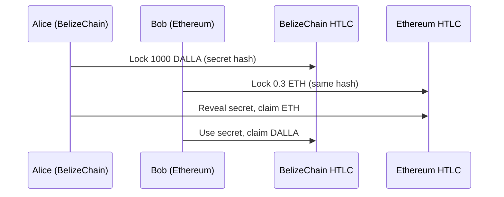

# Cross-Chain Asset Management

## Overview

Comprehensive asset registry and management system for bridged tokens between BelizeChain and external networks. Supports wrapped tokens, liquidity pools, atomic swaps, and NFT bridging.

## Supported Asset Types

### 1. Fungible Tokens (PSP22)
- ERC-20 from Ethereum
- Native parachain tokens from Polkadot
- Wrapped tokens (wETH, wBTC, wDOT)

### 2. Non-Fungible Tokens (PSP34)
- ERC-721 from Ethereum
- Unique collectibles
- Land titles (LandLedger integration)

### 3. Stablecoins
- USDC, USDT, DAI (from Ethereum)
- AUSD (from Acala parachain)
- bBZD (native BelizeChain stablecoin)

## Asset Registry

### Wrapped Token Standards

All bridged assets are wrapped with `w` prefix:

| External Asset | BelizeChain Wrapped | Decimals | Bridge Type |
|----------------|-------------------|----------|-------------|
| ETH | wETH | 18 | Ethereum |
| WBTC | wBTC | 8 | Ethereum |
| USDC | wUSDC | 6 | Ethereum |
| USDT | wUSDT | 6 | Ethereum |
| DAI | wDAI | 18 | Ethereum |
| DOT | wDOT | 10 | Polkadot XCM |
| AUSD | wAUSD | 12 | Acala XCM |
| KSM | wKSM | 12 | Kusama XCM |

### Asset Configuration

```rust
pub struct AssetConfig {
    // Asset identification
    pub local_id: AccountId,           // PSP22 contract on BelizeChain
    pub symbol: String,                // e.g., "wETH"
    pub name: String,                  // e.g., "Wrapped Ethereum"
    pub decimals: u8,
    
    // Bridge configuration
    pub bridge_type: BridgeType,       // Ethereum or XCM
    pub external_address: Vec<u8>,     // ERC-20 address or XCM location
    pub minimum_deposit: u128,         // Min bridge amount
    pub maximum_deposit: u128,         // Max bridge amount
    
    // Economic parameters
    pub bridge_fee_bps: u128,          // Fee in basis points (10 = 0.1%)
    pub daily_volume_limit: u128,      // Max daily volume
    
    // Status
    pub active: bool,                  // Can be bridged
    pub verified: bool,                // KYC/AML approved
}

pub enum BridgeType {
    Ethereum,
    PolkadotXCM,
    CosmosIBC,     // Future
}
```

## Liquidity Pool Integration

### Automatic LP Creation

When bridging assets, optionally provide liquidity to BelizeX DEX:

```rust
#[ink(message)]
pub fn bridge_and_provide_liquidity(
    &mut self,
    asset: AccountId,
    amount: u128,
    pair_with: AccountId,        // DALLA or bBZD
    pair_amount: u128,
    slippage_bps: u128,
) -> Result<u128> {
    // 1. Bridge asset from external chain
    let wrapped_amount = self.bridge_asset(asset, amount)?;
    
    // 2. Add liquidity to AMM
    let lp_tokens = self.amm.add_liquidity(
        wrapped_amount,
        pair_amount,
        self.env().caller(),
    )?;
    
    Ok(lp_tokens)
}
```

**Example**:
```typescript
// Bridge 10 ETH and pair with 30,000 DALLA
await assetManager.bridgeAndProvideLiquidity(
  wETHAddress,
  10_000_000_000_000_000_000,  // 10 ETH
  dallaAddress,
  30_000_000_000_000_000_000_000,  // 30k DALLA
  100  // 1% slippage
);
```

### Incentivized Liquidity Mining

Earn additional rewards for providing liquidity to bridged assets:

| Pool | Base APY | DALLA Rewards | Total APY |
|------|---------|---------------|-----------|
| wETH/DALLA | 0.3% fees | 15% | ~15.3% |
| wBTC/DALLA | 0.3% fees | 20% | ~20.3% |
| wUSDC/bBZD | 0.3% fees | 5% | ~5.3% |
| wDOT/DALLA | 0.3% fees | 12% | ~12.3% |

## Atomic Swaps

Cross-chain atomic swaps using Hash Time-Locked Contracts (HTLC):

```rust
pub struct AtomicSwap {
    pub initiator: AccountId,
    pub participant: AccountId,
    pub initiator_asset: AccountId,
    pub participant_asset: AccountId,
    pub initiator_amount: u128,
    pub participant_amount: u128,
    pub hash_lock: [u8; 32],
    pub time_lock: u64,
    pub state: SwapState,
}

pub enum SwapState {
    Pending,
    Locked,
    Completed,
    Refunded,
    Expired,
}
```

### Atomic Swap Flow



**Example**:
```typescript
// Alice initiates swap on BelizeChain
const secret = generateSecret();
const hash = sha256(secret);

await htlc.initiate(
  bobAddress,
  dallaAddress,
  1000_000_000_000_000,  // 1000 DALLA
  hash,
  Date.now() + 3600  // 1 hour expiry
);

// Bob locks ETH on Ethereum
await ethHtlc.lock(
  aliceEthAddress,
  ethToWei(0.3),
  hash,
  Date.now() + 1800  // 30 min expiry
);

// Alice claims ETH by revealing secret
await ethHtlc.claim(secret);

// Bob uses secret to claim DALLA
await htlc.claim(secret);
```

## NFT Bridging

### ERC-721 → PSP34

Bridge unique NFTs from Ethereum to BelizeChain:

```rust
#[ink(message)]
pub fn bridge_nft(
    &mut self,
    erc721_address: [u8; 20],
    token_id: u128,
    recipient: AccountId,
    metadata_uri: String,
) -> Result<AccountId> {
    // 1. Verify NFT locked on Ethereum (via relayer)
    self.verify_ethereum_lock(erc721_address, token_id)?;
    
    // 2. Mint wrapped PSP34 on BelizeChain
    let wrapped_nft = self.mint_wrapped_nft(
        erc721_address,
        token_id,
        recipient,
        metadata_uri,
    )?;
    
    Ok(wrapped_nft)
}
```

**Use Cases**:
- Art collections (CryptoPunks, Bored Apes → BelizeChain)
- Gaming assets (Axie Infinity → BelizeChain)
- Real estate titles (Ethereum → LandLedger)

### PSP34 → ERC-721

Reverse bridging for NFT exports:

```rust
#[ink(message)]
pub fn export_nft(
    &mut self,
    psp34_address: AccountId,
    token_id: u128,
    eth_recipient: [u8; 20],
) -> Result<()> {
    // 1. Burn PSP34 on BelizeChain
    self.burn_wrapped_nft(psp34_address, token_id)?;
    
    // 2. Emit event for relayers
    self.env().emit_event(NftBridgeRequested {
        psp34_address,
        token_id,
        eth_recipient,
    });
    
    // 3. Relayers unlock original ERC-721
    Ok(())
}
```

## Asset Whitelisting

### Governance Approval Process

1. **Proposal Submission**:
   ```rust
   submit_asset_proposal(
       symbol: "wUNI",
       name: "Wrapped Uniswap",
       erc20_address: "0x1f9840a85d5af5bf1d1762f925bdaddc4201f984",
       decimals: 18,
   )
   ```

2. **Community Vote** (7-day period):
   - District councils review
   - KYC/AML compliance check
   - Economic impact assessment

3. **Approval** (requires >50% approval):
   - Asset added to registry
   - Bridge enabled
   - Liquidity incentives configured

### Auto-Approved Assets

Pre-approved without governance vote:

- Top 10 cryptocurrencies by market cap
- Stablecoins (USDC, USDT, DAI)
- Major Polkadot parachains (DOT, ACA, GLMR)

## Multi-Chain Routing

Optimize cross-chain swaps across multiple bridges:

```rust
pub fn find_best_route(
    &self,
    from_asset: AccountId,
    to_asset: AccountId,
    amount: u128,
) -> Result<Vec<RouteStep>> {
    // Example: USDC (Ethereum) → DALLA
    // Route 1: USDC → wUSDC → bBZD → DALLA
    // Route 2: USDC → ETH → wETH → DALLA
    
    let routes = vec![
        vec![
            RouteStep::Bridge(BridgeType::Ethereum),
            RouteStep::Swap(wUSDCAddress, bBZDAddress),
            RouteStep::Swap(bBZDAddress, dallaAddress),
        ],
        vec![
            RouteStep::Swap(usdcAddress, ethAddress),  // On Ethereum
            RouteStep::Bridge(BridgeType::Ethereum),
            RouteStep::Swap(wETHAddress, dallaAddress),
        ],
    ];
    
    // Calculate costs and return cheapest route
    self.optimize_route(routes, amount)
}
```

## Security Features

### 1. Asset Origin Tracking

Every wrapped token tracks its origin:

```rust
pub struct AssetOrigin {
    pub chain: ChainId,
    pub original_address: Vec<u8>,
    pub minted_block: u64,
    pub total_supply: u128,
    pub backed_supply: u128,  // Locked on origin chain
}
```

### 2. Reserve Auditing

Automated verification of 1:1 backing:

```rust
#[ink(message)]
pub fn verify_reserves(&self, asset: AccountId) -> Result<bool> {
    let origin = self.asset_origins.get(asset)?;
    
    // Query locked balance on origin chain
    let locked_balance = self.query_locked_balance(
        origin.chain,
        origin.original_address,
    )?;
    
    // Compare with wrapped supply
    Ok(locked_balance >= origin.backed_supply)
}
```

### 3. Anomaly Detection

Monitor for suspicious activity:

- **Sudden volume spikes**: >10x average triggers alert
- **Large withdrawals**: >$100k requires additional signatures
- **Price deviations**: >5% from external markets triggers pause
- **Rapid minting**: >1000 tx/min triggers rate limiting

## Economic Model

### Bridge Fee Distribution

| Recipient | Share | Purpose |
|-----------|-------|---------|
| Relayers | 50% | Operational costs |
| Treasury | 30% | Development fund |
| Liquidity Providers | 20% | Incentivize deep liquidity |

### Liquidity Mining Rewards

**Total Allocation**: 10M DALLA/year

**Distribution**:
- Major pairs (wETH, wBTC): 60%
- Stablecoins (wUSDC, wDAI): 20%
- Parachains (wDOT, wACA): 15%
- Experimental pairs: 5%

## Integration Examples

### Bridge and Swap (One Transaction)

```typescript
import { BelizeChainSDK } from '@belizechain/sdk';

const sdk = new BelizeChainSDK();

// Bridge USDC from Ethereum and swap to DALLA
const result = await sdk.crossChain.bridgeAndSwap({
  fromChain: 'ethereum',
  fromToken: 'USDC',
  amount: 1000,  // $1000 USDC
  toChain: 'belizechain',
  toToken: 'DALLA',
  slippage: 0.5,  // 0.5%
});

console.log(`Received ${result.outputAmount} DALLA`);
console.log(`Total fees: $${result.totalFees}`);
```

### Cross-Chain Governance Proposal

```typescript
// Submit proposal to increase wETH/DALLA liquidity rewards
await sdk.governance.propose({
  title: 'Increase wETH/DALLA rewards to 25%',
  description: 'Boost liquidity for Ethereum bridge',
  actions: [
    {
      pallet: 'AssetManager',
      call: 'setLiquidityRewards',
      args: {
        pool: 'wETH/DALLA',
        rewardRate: 2500,  // 25% APY
      },
    },
  ],
  deposit: 1000_000_000_000_000,  // 1000 DALLA
});
```

## Performance Benchmarks

| Operation | Latency | Gas Cost |
|-----------|---------|----------|
| Bridge ERC-20 | 3-5 minutes | ~$5-10 (ETH fees) |
| Bridge XCM | 12-18 seconds | <$0.01 |
| Swap bridged asset | 0.5 seconds | ~$0.001 |
| NFT bridge | 5-8 minutes | ~$10-20 |
| Atomic swap | 30-60 minutes | ~$5 |

## Roadmap

**Q1 2025**:
- ✅ Ethereum ERC-20 bridging
- ✅ Polkadot XCM integration
- ⏳ NFT bridging (ERC-721)

**Q2 2025**:
- Cosmos IBC integration
- Bitcoin Lightning Network bridge
- Advanced routing algorithms

**Q3 2025**:
- zkSync L2 integration
- Arbitrum/Optimism support
- Cross-chain governance execution

**Q4 2025**:
- Solana Wormhole integration
- ERC-1155 multi-token bridging
- Interchain messaging protocol

## Resources

- **Documentation**: https://docs.belizechain.org/bridges/assets
- **Asset Registry**: https://assets.belizechain.org
- **Bridge UI**: https://bridge.belizechain.org
- **Support**: bridges@belizechain.org

---

**Built with 💎 for the sovereign nation of Belize 🇧🇿**
