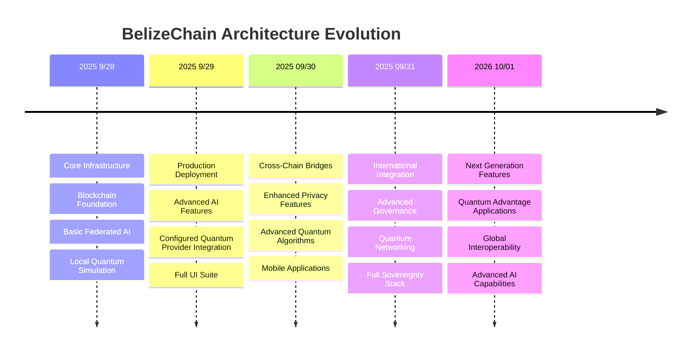

# BelizeChain Architecture

## Overview

BelizeChain represents a groundbreaking approach to sovereign digital infrastructure, combining blockchain technology, federated machine learning, quantum computing, and decentralized storage into a unified, modular system designed specifically for Belize's national needs.

## Core Architecture Principles

### 1. **Sovereignty First**
- Complete control over digital infrastructure
- Compliance with Belizean law and regulations
- Data sovereignty and privacy protection
- Independent operation without external dependencies

### 2. **Modular Design**
- Loosely coupled components
- Extensible architecture for future needs
- Component-specific optimization
- Technology diversity (Rust, Python, TypeScript)

### 3. **Federated Operations**
- Distributed federated learning without data centralization
- Quantum computation orchestration across providers
- Decentralized storage with sovereignty guarantees
- Multi-participant governance mechanisms

## System Architecture

```mermaid
graph TB
    subgraph "BelizeChain Core Infrastructure"
        BC[BelizeChain Node<br/>Substrate Runtime]
        FL[Federated AI Server<br/>Model Aggregation]
        QC[Quantum Coordinator<br/>Hybrid Workloads]
        DS[Storage Layer<br/>IPFS/Arweave]
    end
    
    subgraph "Blockchain Layer"
        BC --> P1[Economy Pallet<br/>bBZD/Dalla]
        BC --> P2[Identity Pallet<br/>BelizeID/DID]
        BC --> P3[Governance Pallet<br/>Democracy/Council]
        BC --> P4[Compliance Pallet<br/>KYC/AML]
        BC --> P5[Staking Pallet<br/>PoUW Consensus]
        BC --> P6[Exchange Pallet<br/>BelizeX DEX]
        BC --> P7[Land Pallet<br/>Property Registry]
        BC --> P8[Bridge Pallet<br/>Cross-chain]
    end
    
    subgraph "AI Federation Layer"
        FL --> AI1[Local Trainers<br/>Government Agencies]
        FL --> AI2[Model Registry<br/>Versioned Models]
        FL --> AI3[Privacy Engine<br/>Differential Privacy]
        FL --> AI4[Compliance Filter<br/>Data Sovereignty]
    end
    
    subgraph "Quantum Layer"
        QC --> Q1[Qiskit Adapter<br/>IBM Quantum]
        QC --> Q2[Configured Quantum Provider<br/>Cloud Quantum]
        QC --> Q3[Algorithm Library<br/>Consensus/Crypto]
        QC --> Q4[Hybrid Circuits<br/>Classical-Quantum]
    end
    
    subgraph "Storage Layer"
        DS --> S1[IPFS Cluster<br/>Distributed Storage]
        DS --> S2[Arweave Archive<br/>Permanent Records]
        DS --> S3[Encryption Layer<br/>Sovereign Keys]
        DS --> S4[Metadata Index<br/>Search/Discovery]
    end
    
    subgraph "User Interfaces"
        UI1[Government Portal<br/>Institutional Access]
        UI2[Citizen Wallet<br/>Personal Finance]
        UI3[Block Explorer<br/>Public Transparency]
        UI4[Developer Tools<br/>SDK/APIs]
    end
    
    subgraph "External Integration"
        EXT1[Traditional Banks<br/>CBB Integration]
        EXT2[Other Blockchains<br/>ETH/ADA/SOL]
        EXT3[Government Systems<br/>Legacy Integration]
        EXT4[International Standards<br/>ISO/FATF]
    end
    
    BC -.-> UI1
    BC -.-> UI2
    BC -.-> UI3
    BC -.-> UI4
    
    P8 -.-> EXT2
    P4 -.-> EXT4
    BC -.-> EXT1
    BC -.-> EXT3
    
    FL --> DS
    QC --> DS
    BC --> DS
```



## Layer-by-Layer Architecture

### Blockchain Core (Substrate-based)

**Runtime Architecture:**
- **Frame System**: Core blockchain functionality
- **Consensus Layer**: Proof of Useful Work (PoUW) 
- **State Machine**: WASM-based runtime execution
- **Transaction Pool**: Mempool with priority queuing
- **Network Layer**: Libp2p-based P2P networking

**Key Pallets:**

1. **Economy Pallet**
   - bBZD (Belize Digital Dollar) - 1:1 peg with BZD
   - Dalla (DALLA) - Main utility token for fees/staking
   - Mahogany - Smallest unit (1 DALLA = 1,000,000 Mahogany)
   - Treasury management and inflation control

2. **Identity Pallet**
   - BelizeID integration (national ID system)
   - DID/SSI (Decentralized Identifiers/Self-Sovereign Identity)
   - Biometric authentication support
   - Passport and citizenship verification

3. **Compliance Pallet**
   - KYC/AML enforcement at protocol level
   - Real-time compliance checking
   - FSC (Financial Services Commission) oversight
   - Automated reporting and audit trails

4. **Governance Pallet**
   - District Council representation
   - Democratic voting mechanisms
   - Proposal and referendum system
   - Multi-signature treasury management

### Federated AI Layer

**Architecture Components:**

1. **Aggregation Server**
   ```python
   # Core aggregation logic
   class BelizeAggregator:
       def aggregate_models(self, client_updates):
           # Secure aggregation with privacy preservation
           # Differential privacy application
           # Model validation and compliance checking
           return aggregated_model
   ```

2. **Client Framework**
   - Privacy-preserving local training
   - Quantized model support (4-bit, 8-bit)
   - Belizean data sovereignty compliance
   - External ML integration for participants

3. **Model Registry**
   - Versioned model storage on IPFS
   - Model performance tracking
   - Deployment and rollback capabilities
   - Compliance certification per model

### Quantum Computing Layer

**Quantum-Classical Hybrid Architecture:**

1. **Quantum Orchestrator**
   ```python
   class QuantumOrchestrator:
       def execute_hybrid_algorithm(self, classical_data, quantum_circuit):
           # Distribute quantum workload across providers
           # Combine classical preprocessing with quantum processing
           # Aggregate results with error mitigation
           return hybrid_result
   ```

2. **Provider Adapters**
   - **Qiskit**: IBM Quantum Network integration
   - **Configured Quantum Provider**: Microsoft quantum cloud services
   - **Rigetti**: Forest/pyQuil integration
   - **IonQ**: Trapped ion quantum computers

3. **Quantum Algorithms**
   - **Quantum consensus algorithms**: Enhanced Byzantine fault tolerance
   - **Quantum cryptography**: Post-quantum security protocols
   - **Quantum optimization**: Resource allocation and routing
   - **Quantum machine learning**: Enhanced federated learning

### Storage Layer

**Decentralized Storage Architecture:**

1. **IPFS Integration**
   ```typescript
   class IPFSAdapter {
     async storeWithSovereignty(data: Buffer, metadata: SovereigntyMetadata) {
       // Encrypt data with Belizean sovereign keys
       // Store with geographical constraints
       // Ensure replication within sovereign boundaries
       return ipfsHash;
     }
   }
   ```

2. **Arweave Archive**
   - Permanent storage for critical records
   - Legal document archival
   - Blockchain state snapshots
   - Regulatory compliance records

3. **Sovereignty Controls**
   - Geo-restricted storage nodes
   - Belizean encryption standards
   - Data residency compliance
   - Cross-border data controls

## Data Flow Architecture

### Transaction Lifecycle

1. **Transaction Initiation**
   ```
   User Wallet → Transaction Pool → Compliance Check → Block Inclusion
   ```

2. **Consensus Process**
   ```
   PoUW Validation → Quantum Enhancement → Finality → State Update
   ```

3. **Cross-Layer Integration**
   ```
   Blockchain Event → AI Model Update → Quantum Optimization → Storage Archive
   ```

### Federated Learning Lifecycle

1. **Model Distribution**
   ```
   Central Model → IPFS Storage → Client Download → Local Training
   ```

2. **Aggregation Process**
   ```
   Local Updates → Privacy Filter → Secure Aggregation → Global Model Update
   ```

3. **Quantum Enhancement**
   ```
   Classical Aggregation → Quantum Optimization → Enhanced Model → Blockchain Storage
   ```

## Security Architecture

### Multi-Layered Security

1. **Blockchain Security**
   - Cryptographic signatures (Falcon/Ed25519)
   - Proof of Useful Work consensus
   - Finality gadget (GRANDPA)
   - Runtime upgrade security

2. **AI Security**
   - Differential privacy
   - Secure multi-party computation
   - Model poisoning detection
   - Data sovereignty enforcement

3. **Quantum Security**
   - Post-quantum cryptography preparation
   - Quantum key distribution readiness
   - Quantum-safe algorithms
   - Hybrid classical-quantum security

### Compliance Integration

1. **Legal Framework Integration**
   - Belize Financial Services Commission oversight
   - Anti-Money Laundering compliance
   - Data Protection Act enforcement
   - International regulatory harmony

2. **Technical Enforcement**
   - Protocol-level compliance checking
   - Automated regulatory reporting
   - Real-time violation detection
   - Audit trail generation

## Scalability Architecture

### Horizontal Scaling

1. **Blockchain Scaling**
   - Parachain architecture readiness
   - Sharding potential
   - Layer 2 solution integration
   - Cross-chain super interoperability

2. **AI Scaling**
   - Dynamic participant management
   - Model sharding across clients
   - Hierarchical federated learning
   - Edge computing integration

3. **Quantum Scaling**
   - Multi-provider quantum orchestration
   - Quantum-classical workload balancing
   - Quantum error correction scaling
   - Distributed quantum computing
   - Plugin for SpinQ and other providers
   - Plugin architecture for new quantum providers

### Performance Optimization

1. **Database Layer**
   ```
   RocksDB → Custom Indexing → Query Optimization → Caching Layer
   ```

2. **Network Optimization**
   ```
   Libp2p → Custom Protocols → Traffic Shaping → CDN Integration
   ```

3. **Compute Optimization**
   ```
   WASM Runtime → JIT Compilation → Resource Management → Load Balancing
   ```

## Deployment Architecture

### Current Ceiba Self-Hosted Deployment

```yaml
services:
   ceiba-node:
      image: belizechain/ceiba-node:latest
      container_name: ceiba-node
      restart: unless-stopped
      ports:
         - "0.0.0.0:30333:30333"
         - "100.81.45.25:9944:9944"
         - "9615:9615"
      volumes:
         - /data/chain:/data/chain
      command: >
         --dev
         --base-path /data/chain
         --port 30333
         --rpc-port 9944
         --prometheus-port 9615
         --rpc-external
         --rpc-methods Safe
         --name Ceiba-Node-1
```

Kubernetes examples in older documents are legacy references. Current operations are Docker and Docker Compose on Ceiba.

### Current Operating Model

1. **Container Orchestration**
    - Docker Compose on Ceiba
    - Containerized node and sibling services
    - Tailscale-scoped RPC exposure
    - Host-level automation and recovery procedures

2. **Monitoring and Observability**
   - Prometheus metrics collection
   - Grafana dashboards
   - Jaeger distributed tracing
   - ELK stack logging

3. **CI/CD Pipeline**
   - GitHub Actions automation
   - Multi-environment deployments
   - Automated testing
   - Security scanning

## Future Architecture Evolution

### Planned Enhancements

1. **Advanced Quantum Integration**
   - Quantum networking protocols
   - Distributed quantum consensus
   - Quantum-enhanced privacy
   - Quantum supremacy preparation

2. **AI/ML Advancement**
   - Large language model integration
   - Computer vision capabilities
   - Natural language processing
   - Predictive analytics

3. **Blockchain Evolution**
   - Zero-knowledge proof integration
   - Advanced cryptographic primitives
   - Enhanced interoperability
   - Sustainability improvements

### Roadmap Integration



This architecture provides the foundation for Belize's complete digital sovereignty while maintaining flexibility for future technological advancement and evolving national needs.