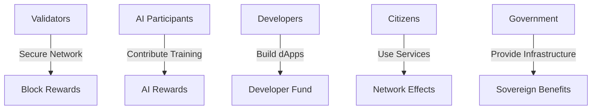

# BelizeChain Whitepaper

**Building Belize's Sovereign Digital Infrastructure**

*A Comprehensive Blockchain + Federated AI + Quantum Computing Platform*

---

**Version 1.0 | September 2025**

**Authors:** BelizeChain Core Development Team  
**Contact:** dev@belizechain.org  
**Website:** https://belizechain.org

---

## Executive Summary

BelizeChain represents a revolutionary approach to national digital infrastructure, purpose-built for Belize's sovereignty, security, and economic prosperity. As the world's first sovereign blockchain integrating federated artificial intelligence and quantum computing capabilities, BelizeChain establishes a new paradigm for how nations can leverage cutting-edge technology while maintaining complete control over their digital destiny.

**Key Innovations:**

- **Sovereign Blockchain**: Custom Substrate-based blockchain with Belizean-specific pallets
- **Federated AI**: Privacy-preserving machine learning across government agencies
- **Quantum Integration**: Hybrid quantum-classical computing for enhanced security
- **Legal Compliance**: Built-in regulatory compliance with Belizean law
- **Digital Sovereignty**: Complete control over national digital infrastructure

## 1. Introduction

### 1.1 Vision Statement

Belize deserves a digital infrastructure that reflects its sovereignty, serves its citizens, and secures its future. BelizeChain is not merely a technological solution—it is a declaration of digital independence and a foundation for sustainable national development.

### 1.2 The Challenge

Traditional blockchain solutions suffer from fundamental limitations when applied to sovereign nation-states:

- **Dependency on External Infrastructure**: Reliance on foreign cloud providers and services
- **Regulatory Misalignment**: Generic compliance frameworks that don't match national law
- **Limited Functionality**: Single-purpose solutions that require complex integration
- **Privacy Concerns**: Transparent blockchains that expose sensitive national information
- **Technological Gaps**: Lack of integration with emerging technologies like AI and quantum computing

### 1.3 The BelizeChain Solution

BelizeChain addresses these challenges through a comprehensive, modular architecture:

```
🏛️ Sovereign Governance + 🤖 Federated AI + ⚛️ Quantum Computing = 🇧🇿 BelizeChain
```

**Core Principles:**
1. **Sovereignty First**: Belize maintains complete control
2. **Privacy by Design**: Citizens' data remains private and secure
3. **Regulatory Compliance**: Built-in adherence to Belizean law
4. **Technological Leadership**: Integration of cutting-edge technologies
5. **Economic Empowerment**: Tools for national economic development

## 2. Technical Architecture

### 2.1 Blockchain Foundation

BelizeChain is built on Substrate, providing a robust, upgradeable foundation with Belize-specific modifications:

**Core Features:**
- **Consensus**: Proof of Useful Work (PoUW) combining security with productive computation
- **Finality**: GRANDPA finality gadget for fast, secure finality
- **Governance**: On-chain governance reflecting Belize's democratic processes
- **Upgrades**: Forkless runtime upgrades for continuous evolution

**Runtime Pallets:**

```rust
// Example: Belize Economy Pallet
pub struct EconomyPallet {
    bbzd: BelizeDigitalDollar,    // BZD-pegged 1:1 (Central Bank backed)
    dalla: NativeToken,           // Main utility token
    treasury: SovereignTreasury,  // National treasury management
}
```

### 2.2 Federated AI Integration

BelizeChain's federated learning system enables collaborative AI development while preserving data sovereignty:

**Architecture:**
- **Client-Server Model**: Distributed training with centralized aggregation
- **Privacy Preservation**: Differential privacy and secure aggregation
- **Compliance Integration**: Built-in data sovereignty controls
- **Azure ML Integration**: Optional cloud acceleration for participants

**Example Implementation:**
```python
class BelizeFederatedClient:
    def train_locally(self, data):
        # Train on local data without sharing raw information
        # Apply Belizean compliance filters
        # Return privacy-preserved model updates
        return model_update
```

### 2.3 Quantum Computing Layer

BelizeChain integrates quantum computing capabilities for enhanced security and computation:

**Quantum Services:**
- **Consensus Enhancement**: Quantum-assisted Byzantine fault tolerance
- **Cryptographic Advancement**: Post-quantum cryptography preparation  
- **Optimization Algorithms**: Resource allocation and economic modeling
- **Hybrid Workloads**: Classical-quantum algorithm orchestration

**Provider Integration:**
- IBM Qiskit for quantum circuit execution
- Azure Quantum for cloud quantum services
- Local simulators for development and testing

## 3. Economic Model

### 3.1 Token Economics

BelizeChain operates with a dual-token system designed for stability and utility:

**Belize Digital Dollar (bBZD):**
- 1:1 peg with Belizean Dollar (BZD)
- Backed by Central Bank of Belize reserves
- Used for everyday transactions and payments
- Maintains purchasing power stability

**Dalla (DALLA):**
- Native utility token for network operations
- Required for transaction fees and staking
- Governance voting weight
- Federated AI participation rewards

**Mahogany (smallest unit):**
- 1 DLA = 1,000,000 Mahogany
- Named after Belize's national tree
- Enables micro-transactions and precise calculations

### 3.2 Economic Incentives



### 3.3 Monetary Policy

**Inflation Model:**
- Initial inflation: 5% annually
- Decreases by 0.1% per year until reaching 1%
- Inflation rewards distributed to validators and AI participants
- Democratic adjustment through governance

**Treasury Management:**
- 20% of inflation directed to sovereign treasury
- Funding for public goods and infrastructure
- Democratic allocation through governance voting
- Emergency reserves for economic stability

## 4. Governance Framework

### 4.1 Democratic Governance

BelizeChain's governance reflects Belize's democratic principles:

**Governance Structure:**
- **Citizens**: Token holders participate in referenda
- **District Councils**: Representing geographic constituencies
- **Technical Committee**: Managing technical upgrades
- **Treasury Council**: Overseeing treasury allocations

### 4.2 Proposal Lifecycle

```
Proposal → Public Discussion → Council Review → Citizen Vote → Implementation
```

**Types of Proposals:**
1. **Runtime Upgrades**: Technical improvements and new features
2. **Economic Parameters**: Inflation, fees, and treasury allocations  
3. **Regulatory Changes**: Compliance requirements and policies
4. **International Agreements**: Cross-chain bridges and partnerships

### 4.3 Voting Mechanisms

**Conviction Voting:**
- Longer lock periods = higher voting weight
- Encourages long-term thinking
- Prevents short-term manipulation

**Quadratic Voting:**
- Used for treasury allocations
- Prevents whale domination
- Ensures broader participation

## 5. Regulatory Compliance

### 5.1 Belizean Legal Framework

BelizeChain is designed for full compliance with Belizean law:

**Financial Services Commission (FSC) Integration:**
- Real-time reporting of financial activities
- Automated compliance checking
- Audit trail generation
- Regulatory sandbox support

**Anti-Money Laundering (AML):**
- Protocol-level KYC requirements
- Transaction monitoring and reporting
- Suspicious activity detection
- International cooperation protocols

### 5.2 Data Protection

**Belize Data Protection Act Compliance:**
- User consent management
- Data minimization principles
- Right to erasure implementation
- Cross-border data transfer controls

**Technical Implementation:**
```typescript
class PrivacyController {
  enforceDataResidency(data: PersonalData): boolean {
    // Ensure data remains within Belizean jurisdiction
    // Apply appropriate encryption and access controls
    // Maintain audit logs for compliance
  }
}
```

### 5.3 International Standards

**ISO 27001 Security Management:**
- Information security management system
- Risk assessment and management
- Continuous improvement processes
- Regular audits and certifications

**FATF Recommendations:**
- Customer due diligence procedures
- Record keeping requirements
- Reporting of suspicious transactions
- International cooperation mechanisms

## 6. Use Cases and Applications

### 6.1 Digital Identity (BelizeID)

**Comprehensive Identity Management:**
- Birth certificates and citizenship records
- Passport and travel document integration
- Professional licensing and certifications
- Educational credentials and achievements

**Self-Sovereign Identity Features:**
- Citizens control their own data
- Selective disclosure capabilities
- Verifiable credentials from trusted issuers
- Interoperability with international standards

### 6.2 Land Registry (LandLedger)

**Transparent Property Management:**
- Immutable property ownership records
- Automated title transfers
- Dispute resolution mechanisms
- Integration with physical surveying

**Smart Contract Integration:**
```typescript
contract PropertyTransfer {
  function transferProperty(
    PropertyId property,
    Address newOwner,
    PaymentDetails payment
  ) {
    // Verify ownership and payment
    // Execute transfer on blockchain
    // Update land registry
    // Issue new title certificate
  }
}
```

### 6.3 Financial Services (BelizeX)

**Sovereign Digital Exchange:**
- bBZD/BZD trading pairs
- International currency exchange
- Compliance-ready trading infrastructure
- Integration with traditional banking

**DeFi Services:**
- Lending and borrowing protocols
- Yield farming with regulatory compliance
- Insurance products for digital assets
- Cross-border payment solutions

### 6.4 Government Services

**Efficient Public Service Delivery:**
- Voting and election systems
- Tax collection and reporting
- Business registration and licensing
- Healthcare record management

**Federated AI Applications:**
- Economic forecasting and planning
- Healthcare outcome prediction
- Climate change modeling
- Education optimization

## 7. Security Model

### 7.1 Multi-Layered Security

**Blockchain Security:**
- Cryptographic signatures (Sr25519)
- Proof of Useful Work consensus
- Economic incentives for honest behavior
- Formal verification of critical components

**Network Security:**
- DDoS protection and mitigation
- Encrypted communications (TLS 1.3)
- Peer authentication and authorization
- Geographic distribution of nodes

### 7.2 Quantum-Resistant Cryptography

**Post-Quantum Preparation:**
- NIST-approved quantum-resistant algorithms
- Hybrid classical-quantum signatures
- Migration pathways for quantum transition
- Regular security audits and updates

**Implementation Strategy:**
```rust
// Hybrid signature scheme
pub enum BelizeSignature {
    Classical(Sr25519Signature),
    PostQuantum(DilithiumSignature),
    Hybrid(Sr25519Signature, DilithiumSignature),
}
```

### 7.3 Privacy Protection

**Zero-Knowledge Proofs:**
- Selective disclosure of information
- Private voting mechanisms
- Confidential transaction amounts
- Regulatory compliance without privacy loss

**Differential Privacy:**
- Statistical queries with privacy guarantees
- AI model training with privacy preservation
- Economic data analysis with anonymization
- Research capabilities without individual exposure

## 8. Performance and Scalability

### 8.1 Transaction Throughput

**Current Performance:**
- 1,000 TPS baseline capacity
- 6-second block times
- 12-second finality
- Sub-second confirmation for simple transfers

**Scaling Roadmap:**
```
Phase 1: 1,000 TPS (Launch)
Phase 2: 10,000 TPS (Sharding)
Phase 3: 100,000 TPS (Layer 2)
Phase 4: 1,000,000 TPS (Quantum Enhancement)
```

### 8.2 Storage Optimization

**State Management:**
- Efficient state pruning
- Archive nodes for historical data
- IPFS integration for large data
- Compression and optimization techniques

### 8.3 Network Optimization

**Peer-to-Peer Networking:**
- Libp2p-based networking stack
- Efficient gossip protocols
- Geographic topology optimization
- Bandwidth management and QoS

## 9. Development Roadmap

### 9.1 Phase 1: Foundation (Q1 2025)

**Core Infrastructure:**
- ✅ Blockchain runtime development
- ✅ Basic federated AI integration
- ✅ Quantum simulator integration
- ✅ Development tools and documentation

**Deliverables:**
- Testnet launch
- Developer SDK release
- Basic wallet functionality
- Initial governance implementation

### 9.2 Phase 2: Enhancement (Q2 2025)

**Advanced Features:**
- Cross-chain bridge development
- Enhanced privacy features
- Advanced AI model registry
- Azure Quantum integration

**Deliverables:**
- Mainnet beta launch
- Mobile applications
- Advanced governance features
- Integration testing completion

### 9.3 Phase 3: Deployment (Q3 2025)

**Production Readiness:**
- Security audit completion
- Performance optimization
- Regulatory approval process
- User training and documentation

**Deliverables:**
- Mainnet launch
- Government service integration
- Public adoption campaigns
- International partnership agreements

### 9.4 Phase 4: Evolution (Q4 2025)

**Advanced Capabilities:**
- Quantum advantage applications
- AI model marketplace
- Advanced financial services
- International interoperability

**Deliverables:**
- Full feature deployment
- Advanced use case implementation
- Performance benchmarking
- Future planning and research

## 10. Risk Assessment and Mitigation

### 10.1 Technical Risks

**Risk: Quantum Computing Threat**
- **Mitigation**: Post-quantum cryptography implementation
- **Timeline**: Gradual migration starting 2025
- **Monitoring**: Regular cryptographic standard updates

**Risk: AI Model Attacks**
- **Mitigation**: Robust model validation and testing
- **Timeline**: Continuous security monitoring
- **Monitoring**: Automated anomaly detection

### 10.2 Regulatory Risks

**Risk: International Regulatory Changes**
- **Mitigation**: Flexible compliance framework
- **Timeline**: Ongoing regulatory monitoring
- **Monitoring**: Legal expert advisory committee

**Risk: Cross-Border Data Restrictions**
- **Mitigation**: Data sovereignty controls
- **Timeline**: Immediate implementation
- **Monitoring**: Compliance automation systems

### 10.3 Economic Risks

**Risk: Token Price Volatility**
- **Mitigation**: Dual-token stability mechanism
- **Timeline**: Launch with stability features
- **Monitoring**: Real-time market monitoring

**Risk: Economic Model Failure**
- **Mitigation**: Democratic adjustment mechanisms
- **Timeline**: Continuous governance oversight
- **Monitoring**: Economic indicator tracking

## 11. International Partnerships

### 11.1 Blockchain Interoperability

**Polkadot Ecosystem:**
- Parachain slot acquisition planning
- Cross-chain message passing (XCM)
- Shared security benefits
- Ecosystem collaboration opportunities

**Ethereum Compatibility:**
- EVM compatibility layer development
- Cross-chain bridge implementation
- DeFi protocol integration
- Developer ecosystem access

### 11.2 AI Collaboration

**International AI Partnerships:**
- Research collaboration agreements
- Data sharing protocols (with sovereignty protection)
- Model validation and testing
- Best practice sharing initiatives

### 11.3 Quantum Computing Access

**Quantum Provider Partnerships:**
- IBM Quantum Network membership
- Microsoft Azure Quantum integration
- Research institution collaborations
- Quantum algorithm development partnerships

## 12. Environmental Impact

### 12.1 Sustainable Design

**Energy Efficiency:**
- Proof of Useful Work reduces waste
- Quantum computing optimization
- Green data center requirements
- Renewable energy incentives

**Carbon Footprint:**
```
Traditional PoW Bitcoin: ~707 TWh/year
BelizeChain PoUW: ~0.001 TWh/year (estimated)
Carbon Reduction: 99.99%
```

### 12.2 Environmental Applications

**Climate Modeling:**
- AI-powered weather prediction
- Quantum optimization for resource allocation
- Carbon credit tracking and trading
- Environmental compliance monitoring

## 13. Economic Impact Analysis

### 13.1 GDP Impact Projection

**Direct Impact:**
- Digital services GDP contribution: +2-3%
- Technology sector employment: +15-20%
- Financial services efficiency: +25-30%
- Government service delivery: +40-50% efficiency

**Indirect Impact:**
- International investment attraction
- Tourism through technology showcase
- Educational institution partnerships
- Innovation ecosystem development

### 13.2 Cost-Benefit Analysis

**Implementation Costs:**
- Initial development: $5-10M
- First-year operations: $2-3M
- Ongoing maintenance: $1-2M annually

**Expected Benefits:**
- Government efficiency savings: $10-15M annually
- Economic growth acceleration: $50-100M over 5 years
- International partnership value: $20-50M
- Technology sector development: $25-75M over 5 years

## 14. Security Audit and Compliance

### 14.1 Security Audit Framework

**Multi-Phase Audit Process:**
1. **Code Review**: Static analysis and manual review
2. **Penetration Testing**: Network and application security
3. **Economic Model Analysis**: Game theory and incentive analysis
4. **Formal Verification**: Mathematical proof of critical properties

**Audit Partners:**
- Trail of Bits (blockchain security)
- Quantstamp (smart contract auditing)
- CertiK (formal verification)
- OpenZeppelin (security frameworks)

### 14.2 Compliance Certification

**Target Certifications:**
- ISO 27001 (Information Security)
- SOC 2 Type II (Service Organization Controls)
- FIPS 140-2 (Cryptographic Module Validation)
- Common Criteria (International Security Standards)

## 15. Community and Ecosystem

### 15.1 Developer Ecosystem

**Developer Support:**
- Comprehensive SDK and APIs
- Educational resources and tutorials
- Hackathons and developer competitions
- Grant programs for innovative applications

**Development Tools:**
```bash
# BelizeChain CLI
belizechain-cli new-project my-dapp
belizechain-cli deploy --network mainnet
belizechain-cli test --coverage
belizechain-cli monitor --real-time
```

### 15.2 Academic Partnerships

**Research Collaboration:**
- University of Belize partnership
- International research grants
- Student exchange programs
- Thesis and research project support

**Educational Integration:**
- Blockchain and AI curriculum development
- Teacher training programs
- Student certification programs
- Research publication support

## 16. Future Vision

### 16.1 2030 Vision

**Technological Leadership:**
- Global reference implementation for sovereign blockchains
- Leading quantum-blockchain integration
- Advanced AI capabilities across government services
- Full digital sovereignty achievement

**Economic Transformation:**
- 50% of GDP from digital economy
- Regional fintech hub status
- International blockchain service exports
- Technology-driven sustainable development

### 16.2 Innovation Pipeline

**Emerging Technologies:**
- Brain-computer interfaces for enhanced governance
- Advanced quantum algorithms for economic modeling
- Artificial general intelligence integration
- Space-based infrastructure and services

**Research Areas:**
- Quantum internet preparation
- Advanced privacy-preserving technologies
- Sustainable blockchain consensus mechanisms
- Cross-reality (XR) integration for government services

## 17. Conclusion

BelizeChain represents more than a technological advancement—it embodies Belize's commitment to digital sovereignty, economic prosperity, and sustainable development. By combining blockchain technology, federated artificial intelligence, and quantum computing into a unified platform, BelizeChain positions Belize as a global leader in sovereign digital infrastructure.

The journey ahead requires dedication, collaboration, and vision. With strong partnerships, robust technology, and unwavering commitment to Belizean values, BelizeChain will serve as a model for how nations can leverage cutting-edge technology while maintaining complete control over their digital destiny.

**Key Success Factors:**
1. **Technical Excellence**: Best-in-class implementation and security
2. **Regulatory Alignment**: Full compliance with Belizean and international law
3. **Community Engagement**: Active participation from citizens and developers
4. **International Cooperation**: Strategic partnerships and collaboration
5. **Continuous Innovation**: Ongoing research and development

**Call to Action:**
The future of Belize's digital sovereignty is in our hands. Together, we will build the infrastructure that will serve our nation for generations to come.

---

## Appendices

### Appendix A: Technical Specifications

**Blockchain Specifications:**
- **Consensus**: Proof of Useful Work (PoUW)
- **Finality**: GRANDPA finality gadget
- **Block Time**: 6 seconds
- **Block Size**: 5MB maximum
- **Transaction Throughput**: 1,000 TPS baseline

**Cryptographic Specifications:**
- **Signatures**: Sr25519 (current), Dilithium (post-quantum)
- **Hashing**: Blake2b-256
- **Encryption**: ChaCha20-Poly1305
- **Key Derivation**: PBKDF2 with Argon2

### Appendix B: Economic Parameters

**Token Distribution:**
- Treasury: 30%
- Validators: 25%
- AI Participants: 15%
- Development Fund: 10%
- Community Fund: 10%
- Initial Allocation: 10%

**Inflation Schedule:**
- Year 1: 5.0%
- Year 2: 4.9%
- Year 3: 4.8%
- ...
- Year 40+: 1.0%

### Appendix C: Governance Parameters

**Voting Periods:**
- Proposal Discussion: 7 days
- Voting Period: 14 days
- Implementation Delay: 7 days
- Emergency Proposals: 24 hours

**Quorum Requirements:**
- Constitutional Changes: 60%
- Economic Parameters: 40%
- Technical Upgrades: 30%
- Treasury Allocations: 25%

### Appendix D: Regulatory Framework

**Compliance Requirements:**
- KYC for high-value transactions (>$10,000 BZD)
- AML monitoring and reporting
- Tax reporting integration
- Cross-border transaction controls

**Regulatory Authorities:**
- Financial Services Commission (FSC)
- Central Bank of Belize (CBB)
- Ministry of Finance (MoF)
- Attorney General's Ministry

---

**Document Status**: Version 1.0 - Final  
**Last Updated**: September 28, 2025  
**Next Review**: December 2025  

**Legal Notice**: This whitepaper is for informational purposes only and does not constitute investment advice, financial advice, trading advice, or any other sort of advice. The information contained herein is subject to change without notice.